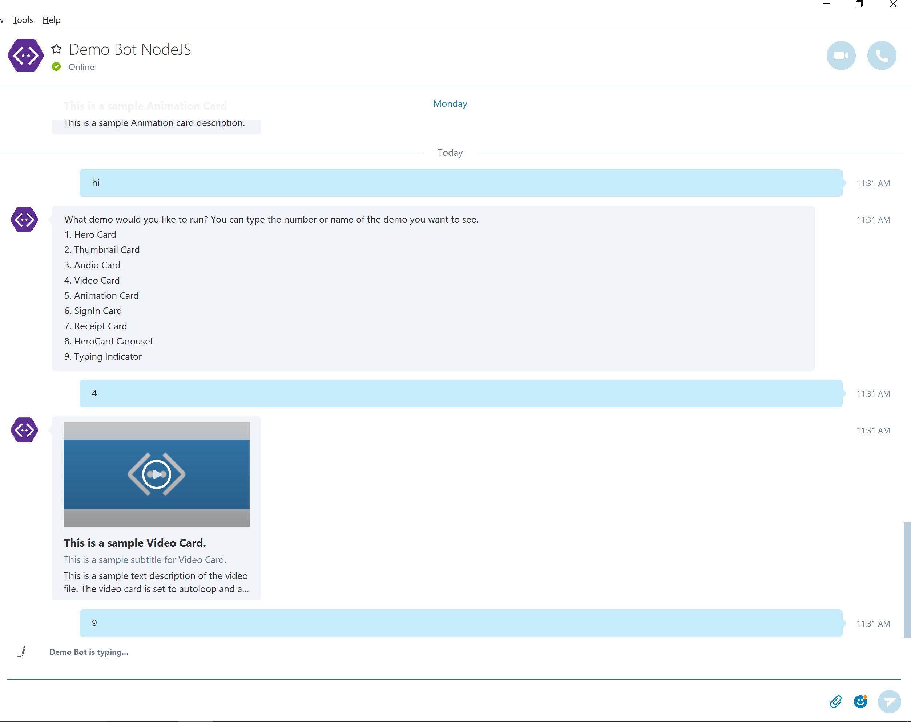

# Api samples for NodeJS based bot
This is a sample bot created using bot framework apis. It's designed to showcase what's possible on Skype using the BotBuilder SDK. 
The demo shows how to create a:
1. Welcome message in 1:1 and group chat
2. Rich text message (text formatting, emoticons)
3. Hero card - all text blocks and buttons
4. Hero card - image only
5. Hero card - buttons only
6. Hero carousel
7. Thumbnail card - all text blocks and buttons
8. Video card SD - autoplay, autoloop
9. Audio card
10. Animated GIF card
11. Sign in card
12. Typing indicator

[Deploy Node/core-ApiSamples]: https://azuredeploy.net?repository=https://github.com/microsoft/BotBuilder-Samples/tree/master/Node/core-ApiSamples
[Deploy Button]: https://azuredeploy.net/deploybutton.png
[![Deploy to Azure][Deploy Button]][Deploy Node/core-ApiSamples]

### Prerequisites
The minimum prerequisites to run this sample are:
1. Latest Node.js with NPM. Download it from [here](https://nodejs.org/en/download/).
2. The Bot Framework Emulator. To install the Bot Framework Emulator, download it from [here](https://emulator.botframework.com/). Please refer to [this documentation article](https://github.com/microsoft/botframework-emulator/wiki/Getting-Started) to know more about the Bot Framework Emulator.
3. **[Recommended]** Visual Studio Code for IntelliSense and debugging, download it from [here](https://code.visualstudio.com/) for free.

### Code Highlights
With the bot builder sdk, it is very easy to create replies (text messages or rich cards) with very few lines of code. Here is an example of how to create a hero card:
```
var message = new global.botBuilder.Message(session);
var heroCard = new global.botBuilder.HeroCard(session)
            .title("This is a sample Hero Card.")
            .subtitle("This is a sample subtitle for the Hero Card. Tapping on the hero card will open a url.")
            .text("This shows rich text supported by Hero Card like <b><u>Formatted Text</u></b> and :) smileys")
            .images([
                global.botBuilder.CardImage.create(session, "https://docs.botframework.com/images/demo_bot_image.png")
            ])
            .buttons([
                global.botBuilder.CardAction.imBack(session, "[internal] The payload of this button goes back to the bot as a next message and is visible in the chat stream.", "IM Back"),
                global.botBuilder.CardAction.postBack(session, "[internal] The payload of this button goes back to the bot as a next message and is not visible in the chat stream.", "Post Back"),
                global.botBuilder.CardAction.openUrl(session, "https://bing.com", "OpenUrl")
            ])
            .tap(global.botBuilder.CardAction.openUrl(session, "https://bing.com"));

message.addAttachment(heroCard);
session.send(message);
```

You can even show the typing indicator while executing long running tasks to give the impression to the user that the bot is thinking:
```
function (session)
{
  // Send a typing indicator to the user to show that the bot is responding with something.
  session.sendTyping();
  session.endDialog();
}
```

### Outcome
You will see the following result in the Bot Framework Emulator when opening and running the sample.


While running on skype, the bot will look like this:


### More Information
To get more information about how to get started in Bot Builder for Node, please review the following resources:
1. [Bot Builder for Node.js Reference](https://docs.botframework.com/en-us/node/builder/overview/#navtitle)
2. [Message.attachments](https://docs.botframework.com/en-us/node/builder/chat-reference/classes/_botbuilder_d_.message.html#attachments)
3. [Message.attachmentLayout](https://docs.botframework.com/en-us/node/builder/chat-reference/classes/_botbuilder_d_.message.html#attachmentlayout)
4. [AttachmentLayout](https://docs.botframework.com/en-us/node/builder/chat-reference/modules/_botbuilder_d_.html#attachmentlayout)
5. [Adding Attachments to a Message](https://docs.botframework.com/en-us/core-concepts/attachments)
6. [Carousel Layout in Microsoft Teams](https://msdn.microsoft.com/en-us/microsoft-teams/bots#carousel-layout)
7. [Hero Card API Reference](https://docs.botframework.com/en-us/node/builder/chat-reference/classes/_botbuilder_d_.herocard.html)
8. [How to deploy to azure](https://docs.botframework.com/en-us/node/builder/guides/deploying-to-azure/#i-want-to-setup-continuous-integration-from-github)
